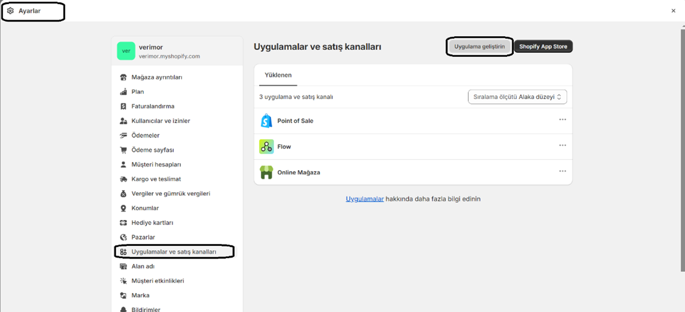
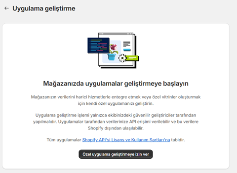
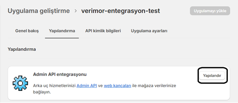
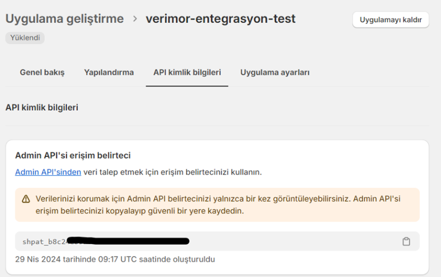

**Shopify – Bulutsantralim Entegrasyonuyla Neler Yapabilirsiniz?**
----
Shopify entegrasyonunun amacı ve özellikleri hakkında bilgi almak için şu sayfayı inceleyebilirsiniz:  https://www.bulutsantralim.com/entegrasyonlar/shopify-bulutsantralim-entegrasyonu

* Siparişim Ne Durumda?

     * Müşteri hizmetlerinizi arayan müşterilerinizin sipariş ve kargo durumlarını sesli karşılama robotuyla canlı biri olmadan okutabilirsiniz. Böylelikle bu konulardaki talepleri iş gücüne ihtiyaç duymadan Bulutsantralim aracılığıyla çözebilirsiniz..
* Kapıda Ödeme Onayı Çalışma Mantığı
  * Aldığınız siparişlerden ödeme tipi "Cash On Delivery" olanları çeker ve arama başlatılır.
  * Otomatik arama ile onay alınan siparişlerinizin not kısmına "Kapıda ödeme onaylandı" notu eklenir, iptal edilenler ise şüpheli, riskli işlem bildirimi eklenip sipariş iptal edilir.

----
**Kurulum**
----
* Shopify paneli üzerinden uygulama oluşturun.
     * Ayarlar(Settings) > Uygulamalar ve satış kanalları
(Apps and sales channels) > Uygulama geliştirin(Develop apps) butonuna tıklayın.\
     
     * Özel uygulama geliştirmeye izin ver adımları takip edin.\
     
     * Uygulama oluştur (Create an app) butonuna tıklanıp, uygulama adı(App name) ve geliştirici (App developer) seçilir.\
     
     * Uygulama oluştuktan sonra, Yapılandırma (Configuration) -> Admin Api entegrasyonu (Admin API integration
) -> Yapılandır (Configure) butonuna tıklanır.\
     
     * 2.1.5.	Burada siparişler(order) ve müşteriler(customer) alanındaki izinler verilmeli ve ardından Kaydet (Save) butonuna tıklanmalı.\
     
     * API kimlik bilgileri (API credentials
) sekmesinden Uygulamayı Yükle (Install app) butonuna tıklanarak. Erişim belirteci (Access Token) kopyalanır.\
     

* Bulutsantralinizdeki ayarları tamamlayın.
     * [Santral Ayarlarım](https://oim.verimor.com.tr/switch/domain/edit) sayfasındaki E-Ticaret Entegrasyonu başlığını bulun.
     * **E-Ticaret Yazılımı** kutusunda **Shopify**'ı seçin
     * **Servis URL** bölümüne site ismini **https://magazaadresim.com** şeklinde girin.
     * **Servis Anahtarı** bölümüne Shopify yönetim panelinden Api kimlik bilgileri kısmından oluşturduğunuz Admin API erişim belirteci anahtarını girin.
     * **Müşteri Temsilcisi** kutusundan, Müşteri temsilcisi hedefini seçin.
     * **Kapıda Ödeme Onayı**nı açın.
     * **Onay ses kaydı** kutusundan kapıda ödeme onayı için arandığında okunacak ses kaydını seçin.
     * **Arayan No** kutusundan kapıda ödeme onayı için, müşterinin hangi numaradan aranacağını seçin.
     * Kaydedin.
     * Gelen aramayı doğrudan sipariş sorgulamaya yönlendirmek istiyorsanız [Gelen Arama Yönetimi](https://oim.verimor.com.tr/switch/dids) sayfasından ilgili numaraya girip hedef olarak **E-Ticaret Sipariş Sorgula** seçin.
     * Sesli Karşılama Menüsünden de sipariş sorgulamaya yönlendirmek istiyorsanız [Sesli Karşılama Menüsü](https://oim.verimor.com.tr/switch/ivrs) sayfasından ilgili Sesli Karşılama Menüsünde **E-Ticaret Sipariş Sorgula** hedefini seçin.

